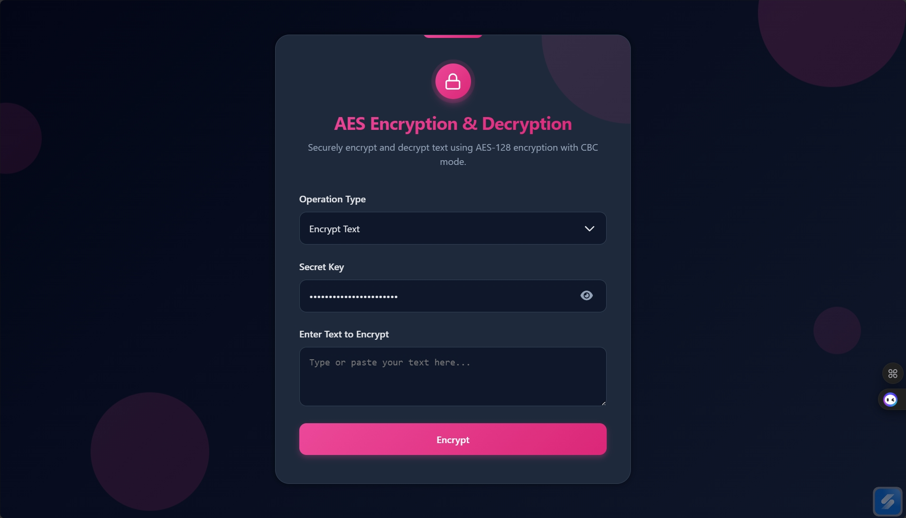

# AES Encryption & Decryption Tool

A beautiful, modern, and secure AES encryption/decryption web app built with pure HTML, CSS, and JavaScript. Instantly encrypt or decrypt any text using AES-128 in CBC mode with a custom secret key.

 

## How It Works
- **Encryption**: Your text is encrypted using AES-128-CBC with a 16-byte random IV. The IV is prepended to the ciphertext and the entire thing is Base64-encoded for easy copying.
- **Decryption**: The Base64 string is decoded, the first 16 bytes are used as IV, the rest as ciphertext, and decrypted with the same derived key.
- **Key Handling**: Your secret key (any length) is hashed with SHA-256, and the first 32 hex characters (128 bits) are used as the AES key.

## Features
- **Instant Encryption & Decryption** — Real-time processing as soon as you click the button
- **AES-128 CBC Mode** — Secure encryption using PKCS7 padding and random IV (IV is prepended to ciphertext)
- **Key Derivation** — Secret key is hashed with SHA-256 and truncated to 128 bits for strong, consistent key generation
- **Toggle Password Visibility** — Eye icon to show/hide your secret key
- **Responsive Layout** — Looks great and works perfectly on desktop, tablet, and mobile devices
- **Success/Error Notifications** — Toast messages with optional vibration feedback on mobile
- **No Backend Required** — Everything runs client-side in the browser

## Libraries Used
- [**CryptoJS**](https://github.com/brix/crypto-js) – Industry-standard AES implementation in JavaScript (loaded via CDN)
- [**Font Awesome**](https://fontawesome.com) – Icons for password visibility toggle and lock branding

All dependencies are loaded via CDN – no build tools or installation required.